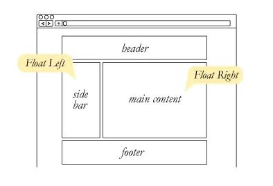
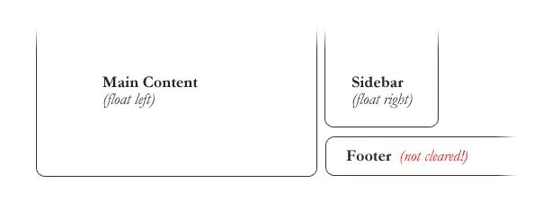
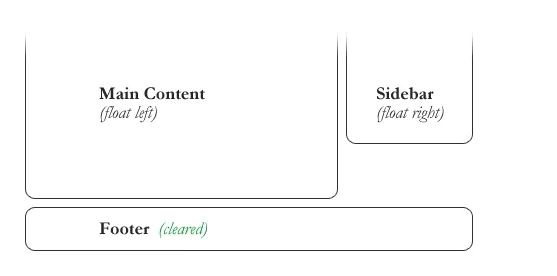
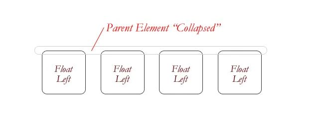
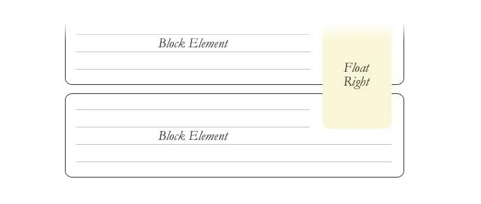

## CSS

### Responsive Web Design

* These days it is hard to find someone who doesn’t own a mobile device, or multiple, connected to the Internet, and should trends continue mobile Internet usage will surpass that of desktop Internet usage within the year.

* So how to build websites suitable for all users?. The industry response to this question has become **responsive web design**, also known as **RWD**.

* Responsive web design is the practice of building a website suitable to work on every device and every screen size, no matter how large or small, mobile or desktop.

#### Responsive vs. Adaptive vs. Mobile

* Responsive and adaptive web design are closely related, and often transposed as one in the same.
  * Responsive generally means to **react** quickly and positively to any change.
  * Adaptive means to be easily **modified** for a new purpose or situation, such as change. 

* A **combination** of the two is ideal, providing the perfect formula for functional websites.

* Mobile, on the other hand, generally means to build a **separate website** commonly on a new domain solely for mobile users.
  * While this does occasionally have its place, *it normally isn’t a great idea*. Mobile websites can be extremely light but they do come with the dependencies of a new code base and browser sniffing, all of which can become an obstacle for both developers and users.

* Responsive web design, favoring design that dynamically adapts to different browser and device viewports, changing layout and content along the way. This solution has the benefits of being all three, responsive, adaptive, and mobile.

* Responsive web design is broken down into three main components, including **flexible layouts**, **media queries**, and **flexible media**. 

#### Flexible Layouts

* The first part, flexible layouts, is the practice of building the layout of a website with a **flexible grid**, capable of dynamically resizing to any width. Flexible grids are built using **relative length units**, most commonly **percentages** or **em** units. These relative lengths are then used to declare common grid property values such as width, margin, or padding.

* CSS3 introduced some new relative length units, specifically related to the viewport size of the browser or device. These new units include **vw**, **vh**, **vmin**, and **vmax**.
  * vw: Viewports width.
  * vh: Viewports height.
  * vmin: Minimum of the viewport’s height and width.
  * vmax: Maximum of the viewport’s height and width.

* The formula to help identify the proportions of a flexible layout using relative values is : `target ÷ context = result`. The formula is based around taking the target width of an element and dividing it by the width of it’s parent element. The result is the relative width of the target element.

* The flexible layout approach alone isn’t enough. At times the width of a browser viewport may be so small that even scaling the the layout proportionally will create columns that are too small to effectively display content. In this event, **media queries** can be used to help build a better experience.

#### Media Queries

* Media queries provide the ability to specify different styles for individual browser and device circumstances, the width of the viewport or device orientation for example.

* There are a couple different ways to use media queries, using the `@media` rule inside of an existing style sheet, **importing** a new style sheet using the `@import` rule, or by linking to a separate style sheet from within the HTML document. Generally speaking it is **recommended** to use the `@media` rule inside of an existing style sheet to avoid any additional HTTP requests.

* Each media query may include a media type followed by one or more expressions. Common media types include **all**, **screen**, **print**, **tv**, and **braille**. The HTML5 specification includes new media types, even including **3d-glasses**. Should a media type not be specified the media query will **default** the media type to **screen**.

* The media query expression that follows the media type may include different media features and values, which then allocate to be **true** or **false**. When a media feature and value allocate to **true**, the styles are **applied**. If the media feature and value allocate to **false** the styles are **ignored**.

* Logical operators in media queries help build powerful expressions. There are three different logical operators available for use within media queries, including **and**, **not**, and **only**.
  * Using the **and** logical operator within a media query allows an **extra condition** to be added, making sure that a browser or devices does both a, b, c, and so forth.
    * The example below selects all media types between 800 and 1024 pixels wide.
    * `@media all and (min-width: 800px) and (max-width: 1024px) {...}`

  * The **not** logical operator negates the query, specifying any query but the one identified. 
    * In the example below the expression applies to any device that does not have a color screen. Black and white or monochrome screens would apply here for example.
    * `@media not screen and (color) {...}`

  * The **only** logical operator is a new operator and is not recognized by user agents using the HTML4 algorithm, thus hiding the styles from devices or browsers that don’t support media queries. 
    * Below, the expression selects only screens in a portrait orientation that have a user agent capable of rending media queries.
    * `@media only screen and (orientation: portrait) {...}`

* When *using* the **not** and **only** logical operators the media type may be left off. In this case the media type is defaulted to **all**.

* One popular technique with using media queries is called **mobile first**. The mobile first approach includes using styles targeted at smaller viewports as the default styles for a website, then use media queries to add styles as the viewport grows.

* Using the **viewport** meta tag with either the **height** or **width** values will define the height or width of the viewport respectively. Each value accepts either a positive **integer** or **keyword**. For the height property the keyword **device-height** value is accepted, and for the width property the keyword **device-width** is accepted. Using these keywords will **inherit** the device’s **default** height and width value. `<meta name="viewport" content="width=device-width">`

* The final, equally important aspect to responsive web design involves flexible media. As viewports begin to change size media doesn’t always follow suit. Images, videos, and other media types need to be scalable, changing their size as the size of the viewport changes.

* One quick way to make media scalable is by using the max-width property with a value of 100%. Doing so ensures that as the viewport gets smaller any media will scale down according to its containers width.

* Unfortunately the max-width property doesn’t work well for all instances of media, specifically around iframes and embedded media. 

* To get embedded media to be fully responsive, the embedded element needs to be absolutely positioned within a parent element. The parent element needs to have a width of 100%.

### Float

* What is **"Float"**?. Float is a CSS positioning property, just like the images in the print layout where the text flows around them. Floated elements **remain** a part of the **flow** of the web page.

* This is distinctly **different** than page elements that use **absolute positioning**. Absolutely positioned page elements are **removed** from the **flow** of the webpage, like when the text box in the print layout was told to ignore the page wrap. Absolutely positioned page elements will not affect the position of other elements and other elements will not affect them, whether they touch each other or not.

* Aside from the simple example of wrapping text around images, floats can be used to create entire web layouts.

* **Example**: 

* Float's sister property is `clear`. An element that has the clear property set on it will not move up adjacent to the float like the float desires, but will move itself down past the float.
  * Without
    * **Example**: 

  * With
    * **Example**: 

* One of the more bewildering things about working with floats is how they can affect the element that contains them (their "parent" element). If this parent element contained nothing but floated elements, the height of it would literally **collapse** to nothing.
  * **Example**: 

* Collapsing almost always needs to be dealt with to prevent strange layout and cross-browser problems. We fix it by clearing the float after the floated elements in the container but before the close of the container.

* If the block element on top were to have automatically expanded to accommodate the floated element, we would have an unnatural spacing break in the flow of text between paragraphs, with no practical way of fixing it.
  * **Example**: 

* 