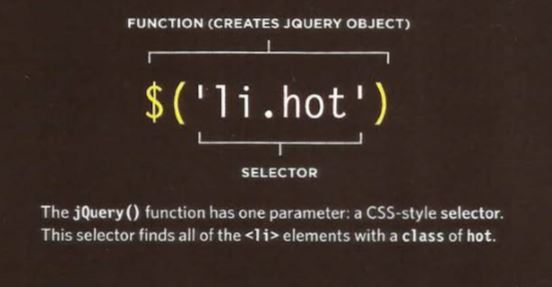
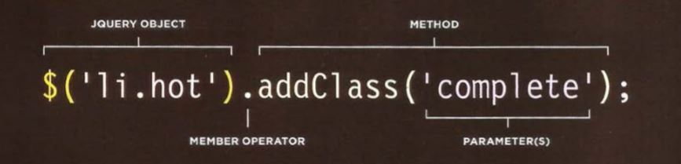

## JQuery

* jQuery offers a simple way to achieve a variety of common JavaScript tasks **quickly** and **consistently**, across all major browsers and without any fallback code needed.

* What is jQuery?!
  * jQuery is a JavaScript file that you include in your web pages. It lets you find elements using **CSS-Style selectors** and then do something with the elements using **methods**.

* When you select one or more elements, a jQuery object is returned. It is also know as a **matched set** or a **jQuery selection**.

  1. Find elements using CSS-style selectors
     * A function called `jQuery()` let's you find one or more elements in the page. It creates and **object** called **jQuery** which holds references to those elements. `$()` is often used as a shorthand to save typing jQuery().
     * Example: 

     * If a selector returns **one element**, the jQuery object contains a **reference** to just **one element node**.

     * If a selector returns **several elements**, the jQuery object contains **references** to **each element**.

  2. Do something with the selected elements
     * The methods of the **jQuery object** are used to update the elements that it contains. in the following example the method `.addClass()` adds a new value to the class attribute.
     * Example: 

* When a selection is made with jQuery, it stores a reference to the corresponding nodes in the DOM tree. It does not create copies of them.

* With jQuery, when a selector returns multiple elements, you can update all of them using the one method. **There is no need to use a loop**.
  * Example: `$('li hot') .addClass('favorite');`
  * In this example the selector applies to three elements. And adds a new class *favorite* for each element.

* The ability to update all of the elements in the jQuery selection is known as **implicit iteration**. 

* It's possible to use more than one jQuery method on the same selection of elements, using dot notation to separate each one, as shown below. 
  * Example: `$('li[id != "one"]').hide().delay(SOO).fadeln(1400);`
  * The process of placing several methods in the same selector is referred to as **chaining**. As you can see, it results in code that is far more compact.

* The position of `<script>` elements can affect how quickly a web page seems to load. And the best place to place them is right before the closing of the `<body>` tag to make sure the HTML loads before running scripts.

## Pair Programming

* **Why pair program?**
  * While learning to code, developers likely study several programming     languages. Similar to a foreign language class, there are four fundamental skills that help anyone learn a new language: 
    1. Listening: hearing and interpreting the vocabulary.
    2. Speaking: using the correct words to  communicate an idea.
    3. Reading: understanding what written language intends to convey.
    4. Writing: producing from scratch a meaningful matter.
  * Pair programming touches on all four skills: developers explain out loud what the code should do, listen to others’ guidance, read code that others have written, and write code themselves.

1. **Greater efficiency**:
   * when two people focus on the same code base, it is easier to catch mistakes in the making.
   * When coming up with ideas and discussing solutions out loud, two programmers may come to a solution faster than one programmer on their own.
   * Also, when the pair is stuck, both programmers can research the problem and reach a solution faster.

   *Researches also identified pairing enhances technical skills, team communication, and even enjoyability of coding in the workplace.*

2. **Engaged collaboration**:
   * When two programmers focus on the same code, the experience is **more engaging** and both programmers are **more focused** than if they were working alone. It is **harder to procrastinate** or get off track when someone else is relying on you to complete the work.
   * When developers pair program, they rely more on each other and can often find a solution together without needing to ask for additional help. Ultimately, **this boosts overall confidence**.

3. **Learning from fellow students**:
   * working with a teammate can expose developers to techniques they otherwise would not have thought of.
   * If one programmer is more experienced in a certain skill, they can teach a student who is less familiar with that area. The less experienced developer benefits from the experienced developer’s knowledge and guidance, and the latter benefits from explaining the topic in their own words, further solidifying their own understanding.

4. **Social skills**:
   * Pair programming not only improves programming skills, but can also help programmers develop their interpersonal skills. When just grabbing the keyboard and taking over isn’t an option, getting good at finding the right words is a skill unto itself.
   * This has long-term career impacts. As much as employers want strong programmers, they know it’s essential to hire people who can work well with others.

5. **Job interview readiness**:
   * For most roles, the ability to work with and learn from others and stellar communication skills are as (or more!) important to a company than specific technical skills. Pair programming strengthens all of those skills.
   * A common step in many interview processes involves pair programming between a current employee and an applicant, either in person or through a shared screen. They will carry out exercises together, such as code challenges, building a project or feature, or debugging an existing code base.

6. **Work environment readiness**:
   * Many companies that utilize pair programing expect to train fresh hires from CS-degree programs on how they operate to actually deliver a product. programmers who are already familiar with how pairing works can hit the ground running at a new job, with one less hurdle to overcome.