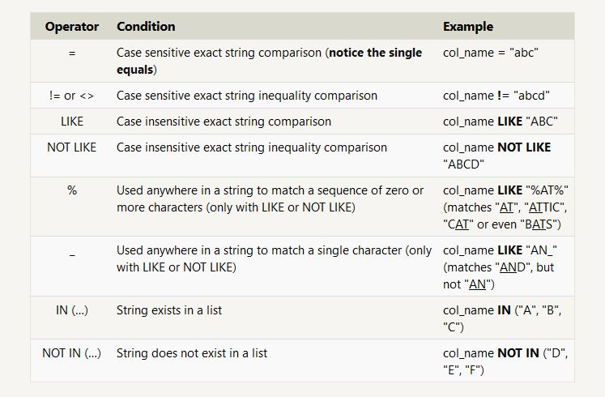

## Structured Query Language **SQL**

### What is SQL?

* **SQL**, or **Structured Query Language**, is a language designed to allow both **technical** and **non-technical *users query***, manipulate, and transform data from a relational database. And due to its simplicity, SQL databases provide safe and scalable storage for millions of websites and mobile applications.

* There are many popular SQL databases including **SQLite**, **MySQL**, **Postgres**, **Oracle** and **Microsoft SQL Server**. All of them support the common SQL language standard.

* A **relational database** represents a collection of related (two-dimensional) tables. Each of the tables are similar to an Excel spreadsheet, with a fixed number of named columns (the attributes or properties of the table) and any number of rows of data.

*  A **query** in itself is just a statement which **declares** *what data* we are looking for, *where to find it* in the database, and **optionally**, *how to transform it* before it is returned.

* You can think of a table in SQL as a type of an **entity** (ie. Dogs), and each row in that table as a **specific instance** of that type (ie. A pug, a beagle, a different colored pug, etc). This means that the columns would then represent the **common properties** shared by all instances of that entity (ie. Color of fur, length of tail, etc).

* The most basic query we could write would be one that **selects** for a couple columns (properties) of the table with all the rows (instances).
  * Example: 
    ```
    SELECT column, another_column, …
    FROM mytable;
    ```

* In order to **filter** certain results from being returned, we need to use a **WHERE** clause in the query. The clause is **applied to each row** of data by checking specific column values to determine whether it should be included in the results or not.
  * Example:
    ```
    SELECT column, another_column, …
    FROM mytable;
    WHERE condition
    AND/OR another_condition
    AND/OR …;
    ```
* Conditional clause cheat sheet:
    

* ***Hint***: *As you might have noticed by now, SQL **doesn't require** you to write the keywords all **capitalized**, but as a **convention**, it helps people distinguish SQL keywords from column and tables names, and makes the query easier to read.* 

* When writing **WHERE** clauses with columns containing text data, SQL supports a number of useful operators to do things like case-insensitive string comparison and wildcard pattern matching.
  * All strings must be quoted so that the query parser can distinguish     words in the string from SQL keywords. 

  * Operators cheat sheet:
    