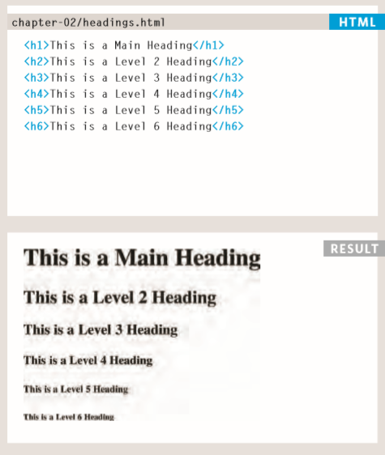
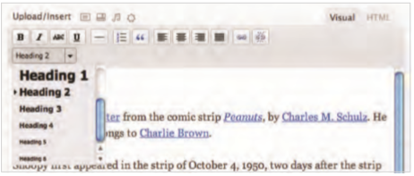
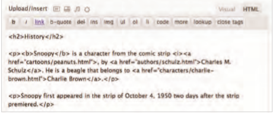

## HTML

### Text  

* When creating a web page, you add tags (known as markup) to the contents of the page. These tags provide extra meaning and allow browsers to show users the appropriate structure for the page.

* There are two types of markup
   1. Structural Markup: such as the elements used to describe headings and paragraphs.
   2. Semantic Markup: which provides extra information; such as where emphasis is placed in a sentence, that something you have written is a quotation (and who said it), the meaning of acronyms, and so on.

* HTML has six "levels" of headings: 

* `<h1>` is used for main headings, `<h2>` is used for subheadings, If there are further sections under the subheadings then the `<h3>` element is used, and so on...

* To create a paragraph, surround the words that make up the paragraph with an opening `
` tag and closing `
` tag. And it's considered a block element.

* When the browser comes across two or more spaces next to each other, it only displays one space. Similarly if it comes across a line break, it treats that as a single space too. This is known as **white space collapsing**.

### Visual editors & Their code Views  

* Content management systems and HTML editors such as Dreamweaver usually have two views of the page you are creating: a visual editor and a code view.

* Visual editors often resemble word processors. Although each editor will differ slightly, there are some features that are common to most editors that allow you to control the presentation of text. 

* Code views show you the code created by the visual editor so you can manually edit it, or so you can just enter new code yourself. It is often activated using a button with an icon that says HTML or has angled brackets. White space may be added to the code by the editor to make the code easier to read.

## CSS  

### Introduction  

* CSS stands for _Cascading Style Sheets_ and it's used to change the appearance of the markup we've written, and it's done using the _selectors_ which allow us to choose a certain element and format and style it the way we want.

* CSS looks at elements as content within a box thus it creates rules to manipulate these boxes and the content within.

* Using CSS would allow us to add borders, change dimensions, colors and many more....

*  A CSS rule contains two parts: a **selector** and a **declaration**.

* Example: ``p {  font-family: Arial;}``
  * in the example above; the part before the curly brackets is called a *selector* and the content inside the curly brackets are the *decleration*.

* *Selectors* decide which element to be manipulated and how it's should be manipulated is indicated by the decleration.
  * Declerations are split into two parts seperated by a colon, and these parts are:
    1. A property
    2. A value

* You can specify several properties in one declaration, each separated by a semi-colon.
  * Example: ``h1, h2, h3 {font-family: Arial; color: yellow;}``

* There are three methods of using CSS:
  1. External CSS:
     * The CSS code is written in an external file with a CSS extension and then linked to the HTML file using the `<link>` tag.

  2. Internal CSS:
     * The CSS code is written inside the HTML file within the `<head>` tag inside a `<style>` tag.

  3. Inline CSS:
     * The CSS code is written within the opening tag of the element to be manipulated using the `style= "decleration:value;"` attribute.

* When building a site with more than one page, you should use an external CSS style sheet. This:

  * Allows all pages to use the same style rules (rather than repeating them in each page).
  
  * Keeps the content separate from how the page looks.
  
  * Means you can change the styles used across all pages by altering just one file (rather than each individual page).

* There are many different types of CSS selector that allow you to target rules to specific elements in an HTML document. Below you'll find most of them.

  

* CSS rules cascade depending on their _specifity_ and _order_.

  * Different selectors have different specifity aslo the more the selected element is deep within the parent elements the more specifity it has.

  * The order means where the selecetor is located horizintally in the code, if two selectors have the same specifity and both of them control the same styling key with different values, then the latter selector is the active one.

* `!important` can be put after any property value to indicate that it should be considered more important than other rules that apply to the same element.

* Some properties could be inherited to child elements form their parent elements such as giving the body a white text color which will automatically change the color of the paragrapghs and headings to the same color.

* Though some properties can't be inherited such as _border_; and the reason for this is that the page will look messy and unpleasent to look at.  

## JavaScript  

### Basic Instructions  

* JavaScript uses a script code that give instructions and orders to make the website dynamic, alive and responsive.

* Each individual instruction or step is known as a statement. Statements should end with a semicolon.  
  * Example: `var today= new Date{);`

* Some statements are surrounded by curly braces; these are known as code blocks. The closing curly brace is not followed by a semicolon. 
  * Example: ``if (hourNow > 18) { greeting= 'Good evening'; alert("Hello!")}``

* A script will have to temporarily store the bits of information it needs to do its job. It can store this data in **variables**.

* It is called a _variable_ because it's value is changable each time we run a code to store a new data inside it.

* To use a variabke you'll need to declare it first, then assign a value to it, and lastly calling it when it's needed.

* You can declare a variable using the code `var nameOfVariable;`

* `nameOfVariable = value` is how we assign a value to a variable;

* And it's called by writing it's name in the context of the code that's going to utilize it's value.

* There are 3 data types:

  1. Numeric data type: Which are numbers.

  2. String data type: The strings data type consists of letters and other characters between single or double qoutation marks.
  
  3. Boolean data type: holds the value of either _true_ or _false_

* We can also store multiple values inside a variable, and in that case it's called an array, and it consists of rows and columns.

* It's declared and called very similar to a normal variable with few  changes.
  * ``var colors = ['white', 'black', 'custom'];`` is an example of an array.

* Each value has a position inside the array referenced by an index which has a value of 0 for the first value, which is white for the above examlple.

* We can call a certain value inside an array by adding the index within square brackets after the array name such as `colors[1]` which returns the value `black`

* it's also possible to change the value of a certain index the same way such as `colors[1] = "beige";` which changes the second value to beige instead of black.

* Arithmetic operators are used on numbers to do certain processes and calculations where for string data we can join them using the **+** sign.  

### Decisions and Loops  

#### Comparison Operators

* The comparison operators are mainly used to get one boolean value output out of multiple inputs, and there are many operaters each has it's own job.

  1. **Is equal to**: It's used to campare two variables to see if they are the same in value only `==`

  2. **Is not equal to**: It's the opposite of _is equal to_ and it's used to see if two variable are not the same value only `!=`

  3. **Strict equal to**: Similar to _is equal to_ but it checks if the two variables are equal in value and also **typing** `===`

  4. **Strict not equal to**: The exact opposite of _strict equal to_ where it checks if the two variables are not equal in value and also **typing** `!==`

  5. **Greater than**: It check if the number on the left is greater than the number on the right `>`

  6. **Less than**: It's the opposite of _greater than_ where it checks if the number on the left is less than the number on the right `<`

  7. **Greater than or equal to**: similar to _greater than_ but it checks if the number on the left is greater than or equal to the number on the right `>=`

  8. **Greater than or equal to**: similar to _less than_ but it checks if the number on the left is less than or equal to the number on the right `<=`

#### Logical Operators

* The logical operators are used to compare the results of more than one comparisn operator, and each one has a different logic to it.

  1. **Logical and**: It's used to test if both of the expressions are true and outputs _true_, otherwise _false_ `&&`
  2. **Logical or**: It's used to test if one of the expressions is true and outputs _true_, only when both are false it returns _false_ `||`

  3. **Logical not**:It's used to reverse the state of and expression from _true_ to _false_ and vise-versa `!`

#### Loops

* Loops are used to check if a condition is true or false, and depending on the return value it runs a certain block of code inside of it several time until the return value becomes false, there are differnet types of loops simialr in functionality different in structure.

  1. **For loop**: It's used to run a certain code for a certain know amount of times if the condition is met, the syntax looks like `for (var i = 0; i < 0; i++){document.write(i);}`

  2. **While loop**: It's used to run a certaing code for an unkown amount of time depending on the state of the condition, the syntax should look like `while (var i < 10){_a certain code_ , _increament_;}, document.write(msg);`

  3. **Do while loop**: It's used the same way while is used but it will still execute for one time even if the state of the condition is false.
