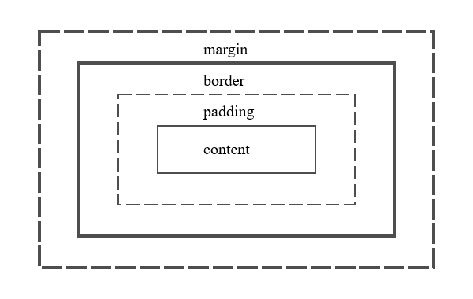

## HTML  

### Lists  

* Lists are used to group together related pieces of information so they are clearly associated with each other and easy to read, frequently used for navigation as well as general content.

* HTML provides us with three different types:

  1* **Ordered lists** are lists where each item in the list is numbered.  
    *Example:*
    ```
    <ol>
        <li>Item 1</li>
        <li>Item 2</li>
        <li>Item 3</li>
    </ol>

    ```  
     * The ordered list is created with the `<ol>` element.
     * Each item in the list is placed between an opening `<li>` tag and a closing `</li>` tag. (The li stands for list item.)


  2. **Unordered lists** are lists that begin with a bullet point (rather than characters that indicate order).
    *Example:* 
    ```
    <ul>
        <li>Item 1</li>
        <li>Item 2</li>
        <li>Item 3</li>
    </ul>
    
    ```  
     * The unordered list is created with the `<ul>` element.
     * Each item in the list is placed between an opening `<li>` tag and a closing `</li>` tag. (The li stands for list item.)


  3. **Definition lists** are made up of a set of terms along with the definitions for each of those terms.  
    *Example:*  
    ```
    <dl>
        <dt>Item 1</dt>
        <dd>Definition of item 1</dd>
        <dt>Item 2</dt>
        <dd>Defenition of Item 2</dd>
    </dl>
    
    ```  
     * The definition list is created with the `<dl>` element and usually consists of a series of terms and their definitions. Inside the `<dl>` element you will usually see pairs of `<dt>` and `<dd>` elements. 
     * `<dt>` is used to contain the term being defined (the definition term).
     * `<dd>`is used to contain the definition.  

* You can put a second list inside an `<li>` element to create a sublist or nested list.  


### Boxes  

* We learned before that **CSS** treats **HTML** elements as if they live inside a **box** and thux we can manipule the properties of these boxes using CSS.  

* For example we can *manipulate* the **dimensions**, **borders**, **margins**, **paddings**, **show** or **hide** these boxes and many more... 

  * Every box has three available properties that can be adjusted to control its appearance:

    1. Border: every box has a border (even if it is not visible or is specified to be 0 pixels wide). The border separates the edge of one box from another.

    2. Margin: margins sit outside the edge of the border. You can set the width of a margin to create a gap between the borders of two adjacent boxes.

    3. Padding: padding is the space between the border of a box and any content contained within it. Adding padding can increase the readability of its contents. 

      

* The **padding** and **margin** properties are very helpful in adding *space* between various items on the page.

* 

## JavaScript  

### Decisions and Loops

* The **switch** statement is a part of JavaScript's *Conditional* Statements, which are used to perform different actions based on different conditions.  

* It evaluates an expression. The value of the expression is then compared with the values of each case in the structure. If there is a match, the associated block of code is executed.  

* The switch statement is often used together with a **break** or a **default** keyword (or both). These are both optional:

  * The **break** keyword breaks out of the switch block. This will stop the execution of more execution of code and/or case testing inside the block. If break is not executed, the next code block in the switch statement is executed.

  * The **default** keyword specifies some code to run if there is no case match. There can only be one default keyword in a switch. Although this is optional, it is recommended that you use it, as it takes care of unexpected cases.

* *Syntax:*

    ```
    switch(expression) {
    case n:
    code block
    break;
    case n2:
    code block
    break;
    default:
        default-code block
    }

    ```  

* Due to type **coercion**, every value in JavaScript can be treated as if it were **true** or **false**.  

  * **Falsy** values are treated as if they are false, and they can also be treated as the number **0**.  

  * **Truthy** values are treated as if they are true, and the can also be treated as the number **1**.

  * The following values consist almost all the falsy values ever known:
    
    * **false**, **0**, **''**, **10/'score'**, and also a **variable with no assigned value to it**.  

  * Almost everything that is not mentioned above can be treated as if it were true. In addition, the presence of an object or an array is usually considered truthy, too. **This is commonly used when checking for the presence of an element in a page**.  


* Loops are used to check if a condition is true or false, and depending on the return value it runs a certain block of code inside of it several time until the return value becomes false, there are differnet types of loops simialr in functionality different in structure.

  1. **For loop**: It's used to run a certain code for a certain know amount of times if the condition is met, the syntax looks like `for (var i = 0; i < 0; i++){document.write(i);}`.

  2. **While loop**: It's used to run a certaing code for an unkown amount of time depending on the state of the condition, the syntax should look like `while (var i < 10){_a certain code_ , _increament_;}, document.write(msg);`.
    
  3. **Do while loop**: It's used the same way while is used but it will still execute for one time even if the state of the condition is false.

