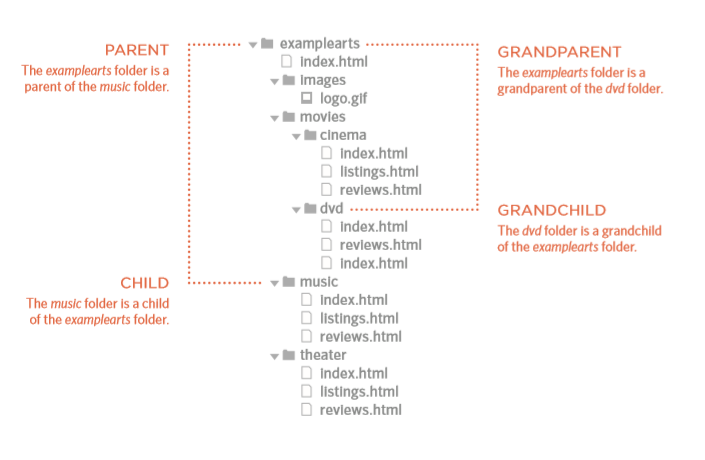
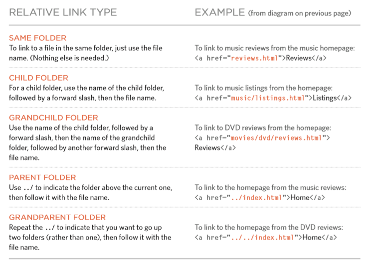

## HTML

### Links

* Links are the defining feature of the web because they allow you to move from one web page to another — enabling the very idea of **browsing** or **surfing**.

* Links are created using the `<a>` for example:
  `<a href="http://www.imdb.com">IMDB</a>`
  * It consists of an opening tag `<a>`, closing tag `</a>`, `href=""`, and *text* between the tags.
    * The **link** or **directory** of the desired page to go to is put inside the double qoutation of the *href*.
    * The text between the tags *resembles* the *name of the link* that will be shown to the user, that when it's **clicked** it will **direct** to the **link destination**.
    * It's more **professional** and **legible** to choose a name that's **related** to the **link**.

* Types of link relations: 
  
  

* It's also possible to use the `<a>` tag to start up the user's email program and addresses an email to a specified email address. However, this time the value of the **href** attribute starts with **mailto:** and is followed by the email address you want the email to be sent to.
  * Example: `<a href="mailto:jon@example.org">Email Jon</a>`  

* If you want a link to **open** in a **new window**, you can use the `target` **attribute** on the opening `<a>` tag. The **value** of this attribute should be `_blank`.

* You can also link to any part of your page by giving it an **id** and then using this id in the **href** part. It can also used to link to a section on a different page, *just add the link of the page followed by the id*.

*

### Layout

* CSS treats each HTML element as if it is in its own box. This box will either be a **block-level** box or an **inline box**.
  * Block-level box: starts on a **new line**. Examples include: `<h1>`, `
`, `<ul>`, and `<li>`.
  * Inline box: inline elements flow in between surrounding text. Examples include: ``, `<b>`, and `<i>`.

* CSS has **positioning schemes** that allow you to control the layout of a page: **normal flow**, **relative positioning**, and **absolute positioning**. You specify the positioning scheme using the position property in CSS. You can also **float** elements using the **float property**.
  * Normal flow: Every **block-level** element appears on a **new line**, causing each item to appear lower down the page than the previous one.
  * Relative Positioning: This moves an element from the position it would be in normal flow, shifting it to the top, right, bottom, or left of where it would have been placed. This does not affect the position of surrounding elements.
  * Absolute positioning: This positions the element in relation to it's containing element, which means it's taken out of normal flow and move as users scroll up and down the page.

* **Floating** an element allows you to take that element out of normal flow and position it to the far left or right of a containing box. The floated element becomes a **block-level** element around which other content can flow.

*  Different sized screens that show different amounts of information, so your design needs to be able to work on a range of different sized screens.

*  Liquid layout designs stretch and contract as the user increases or decreases the size of their browser window. They tend to use percentages.

* Fixed width layout designs do not change size as the user increases or decreases the size of their browser window. Measurements tend to be given in pixels.

## JavaScript

### Functions, Methods and Objects

* Functions let you **group** a series of statements together to perform a specific task. If different parts of a script repeat the same task, you can **reuse** the function (rather than repeating the same set of statements).

* To **create** a function, give it a name and write the code needed to be executed inside the curly brackets, it should look like something like that `function sayHello(){document.write('Hello!')};`

* To execute *(call)* a function you write the function name followed by peranthasis, it should look like `sayHello();`

* Some functions need some information *(parameters)* to preform it's task, in such cases we put this information inside the **paranthesis**, and it should look like `function getArea(width, height){return width * height;}` were *(width and height)* are the parameters.

* To **call** a function that requires parameters, we replace the parameters with there **values** to be put in the function, it should look like `getArea(3,5)` where *(width= 3, and height= 5)*

* Some functions return an **output** when we call them, for example a **summation function** returns the result of adding naumbers.

* A function **declaration** creates a function that you can call later in your code. In order to **call** the function later in your code, you must give it a **name**, so these are known as **named functions**.

* If you put a function where the interpreter would expect to see an expression, then it is treated as an expression, and it is known as a **function expression**. where the function is stored in a variable.

* A function with no name is called an **anonymous function**.

* The **location** where you declare a variable will affect where it can be used within your code. If you declare it within a function, it can only be used within that function. This is known as the **variable's scope**.

  * When a variable is created inside a function using the var keyword, it can only be used in that function. It is called a **local variable**.
  * If you create a variable **outside** of a function, then it can be used anywhere within the script. It is called a **global variable** and has **global scope**.