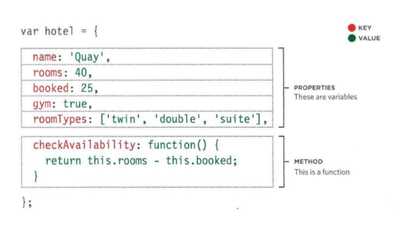
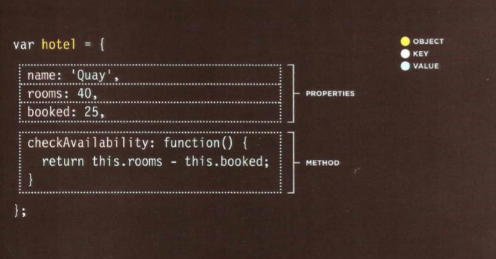
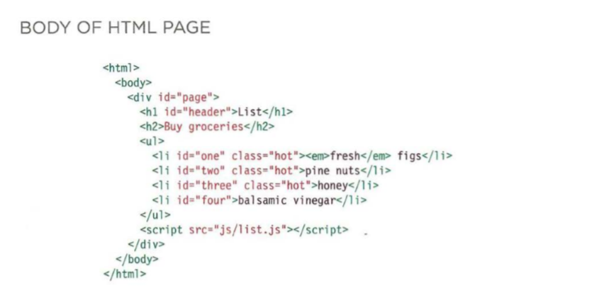
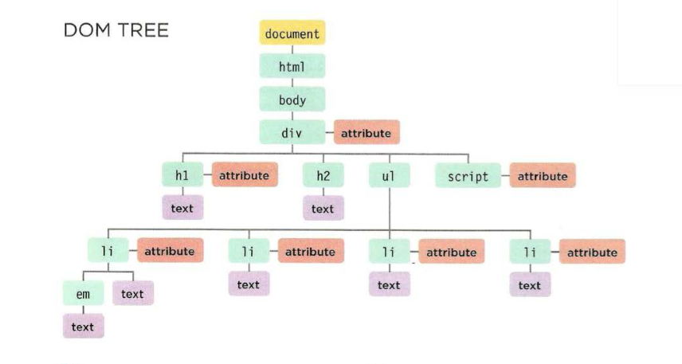

## The Problem Domain

* What is the hardest thing about writing code? each of us has his own version of the answer and list goes on and on.

* But the majority of programmers agree that **understanding the problem domain* is considerd one of if not the hardest thing about programming.

* We as programmers most of the time tend to forget who we really are which is *problem solvers*. And when we are faced with a new idea or problem we tend to focus on the technology we are going to use insted of focusing on the problem domain.

* Programming is like solving a puzzle and if you can't put a general picture and a goal of where you are going then you won't be able to have steps to follow in order to acheive and draw the bigger picture (*Solving the puzzle*).

* And the **challenge** is that many problem domains are like a **puzzle** with a **blurry picture** or **no picture at all**. So you have to **draw the picture** depending on your **approach** and **point of view**.

* With fast pace of modern software development, it’s easy to forget that the main part of software value is in its **“brains”**. 

* You can change GUI technology or infrastructure layer. You even can totally rewrite your application but the **application domain** stays more or less the same and at the end of the day the model defines whether this software is useful or not.

* understanding the problem is the most critical piece to the equation. It is very difficult to solve a problem before you know the question.

* What can you do about it?
  1. **Make the problem domain easier**: You can often make the problem domain easier by *cutting out cases* and narrowing your focus to a particular part of the problem.

  2. **Get better at understanding the problem domain**:
   * It is easy to fall into the **trap** of **thinking** you **understand enough of the problem** to get started coding it.

   * Best to **resist the temptation** to *not waste anymore time talking* and make sure you *understand** a problem inside and out **before** you try and solve it with code.

* And always keep in mind that *it is much more expensive and time consuming to do things over than it is to do them right the first time*. 

## JavaScript

### Object literals

* Objects **group** together a set of **variables** and **functions** to **create** a **model** of a something you would recognize from the real world. *In an object, variables and functions take on new names*.

* **Variables** become known as **properties**, and **funtions** become known as **methods**.

* Like variables and named functions, properties and methods have a name and a value. In an object, that **name** is called a **key**.

* An object **cannot** have **two keys** with the **same name**. This is *because keys are used to access their corresponding values*.

* The value of a property can be a **string**, **number**, **Boolean**, **array**, or even **another object**. The **value** of a **method** is *always* a **function**.

* One of the ways you can **create** an object is **object literals**, **literal notation** is the **easiest** and **most popular** way to create objects.

* Example: 
  * The **object** is the **curly braces** and their **contents**, here the object is is stored in a **variable** called **hotel**.

  * **Seperate** each **key** from it's **value** using a **colon**.

  * **Seperate** each **property** and **method** with a **comma* *(but not after the last one)*.

  * The **properties** and **methods** of an **object** are accessed using the **dot notaiton**.

  * Example: `var hotelName = hotel.name;` or `var roomsFree = hotel.checkAvailability();`

  * It's also possible to create, re to access properties *but not methods* using **square brackets**.

  * Example: `var hotelName = hotel['name'];`

### Document object model

* The Document Object Model (DOM) **specifies** how **browsers** should **create** a *model of an HTML page** and how **JavaScript** can **access and update** the **contents** of a web page while it is in the browser window. 

* Tthe **DOM tree** is a **model of a web page**. As a browser **loads** the web page, it **creates** a **model** of that page. The model is called a DOM tree, and it is **stored** in the **browsers' memory**. It **consists** of **four** main **types** of **nodes**. 

* 

* 

  * Above, you can see the HTML code for a shopping list, and on underneath it is its DOM tree. 

  * Each **node** is an object with methods and properties. Scripts access and update this DOM tree *(not the source HTML file)*. Any changes made to the DOM tree are reflected in the browser.

  * Accessing and updating the DOM tree involves two steps:
    1. Locate the node that represents the element you want to work with. 
    2. Use its text content, child elements, and attributes.

* When people talk about **storing elements** in variables, they are **actually storing** the **location** of the element within the DOM in a variable.

* We can either select a **node** or a **nodelist** using different methods including by **id**, **class**, **tag** ...etc

* It's also possible to create, remove DOM nodes using DOM manipulation mehods.