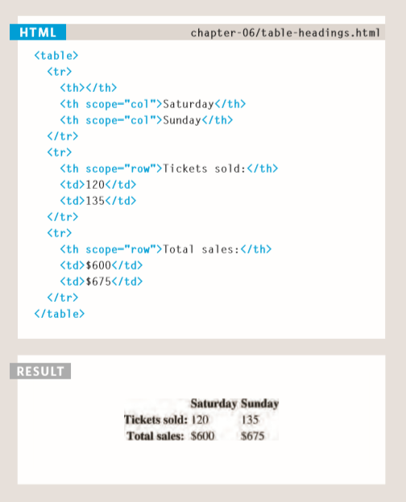

## Domain Modeling

* Domain modeling is the process of creating a conceptual model for a specific problem. And a domain model that's articulated well can verify and validate your understanding of that problem.

* Here's some tips to follow when building your own domain models.

  1. When modeling a single **entity** that'll have many **instances**, build self-contained objects with the same attributes and behaviors.
  2. **Model** its attributes with a **constructor function** that defines and initializes properties.
  3. **Model** its **behaviors** with **small methods** that focus on doing one job well.
  4. Create instances using the new keyword followed by a call to a constructor function.
  5. Store the newly created object in a variable so you can access its properties and methods from outside.
  6. Use the this variable within methods so you can access the object's properties and methods from inside.


## HTML

### Tables

* A table represents information in a **grid format**. 
  * Grids allow us to understand complex data by **referencing** information on **two axes**.
  * Each **block** in the grid is **referred** to as a **table cell**. In HTML a table is written out row by row.

* The `<table>` element is used to create a table. The contents of the table are written out row by row.

* You indicate the start of each row using the opening `<tr>` tag. (The tr stands for table row.) 

* Each cell of a table is represented using a `<td>` element. (The td stands for table data.)

* The `<th>` element is used just like the `<td>` element but its purpose is to represent the heading for either a column or a row. (The th stands for table heading.) 

* Example: 



* Sometimes you may need the entries in a table to stretch across more than one column. The `colspan` attribute can be used on a `<th>` or `<td>` element and indicates how many columns that cell should run across.

* You may also need entries in a table to stretch down across more than one row. The `rowspan` attribute can be used on a `<th>` or `<td>` element to indicate how many rows a cell should span down the table.

* For long tables you can split the table into a `<thead>`, `<tbody>`, and `<tfoot>`.


## JavaScript 

### Construction Notation

* In this method we use the `new` with the object constructor `object()` creats a blank object.

* After creating the **empty** object we can add properties and methods to it using the **dot notation**, with the semi-colon ending each statement.

* Example:

  ```
  var hotel = new Object();

  hotel.name = 'Quay';
  hotel.rooms = 40;
  hotel.booked = 25;

  hotel.checkavailability = function(){
    return this.rooms - this.booked;
  };
  ```

* It's also possible using the dot notaion to update these values after they are assigned.

* When multiple similar objects are to be created, it's best practice to create a function that represents a **template** for creating objects. So the template will be holding the object's properties and methods.

* Example:
  
  ```
  function hotel(name,rooms,booked){
    this.name = name;
    this.rooms = rooms;
    this.booked = booked;

    this.checkAvailability = function(){
      return this.rooms - this.booked;
    };
  }
  ```

* The `this` keyword is used **instead** of the **object name** to **indicate** that the **property** or **method** belongs to the **object** that **this function creates**.

* Then **instances** of the object are created using the **constructor function**.

* The `new` keyword followed by a call to the function creates a new object. The properties of each object are given as arguments to the function.

* Example:

  ```
  var quayHotel = new hotel('Quay', 40, 25);
  var parkHotel = new hotel('Park' 120, 77);
  ```

* Once you have created an object (using literal or constructor notation), you can add new properties to it using the **dot notation**.

* Example:

  ```
  var hotel = { 
    name : 'Park',
    rooms : 120,
    booked : 77,
    }; 

  hotel.gym = true;
  hotel.pool = false;
  delete hotel.booked;

  var elName = document.getElementByld('hotelName');
  elName.textContent = hotel.name; 
  var el Pool = document.getElementByid('pool');
  elPool.className = 'Pool: ' + hotel.pool; 
  var elGym = document.getElementByld('gym'};
  elGym.className = 'Gym: ' + hotel.gym; 
  ```
